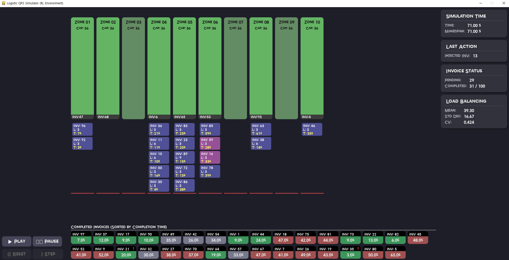

<p align="center">
<h2 align="center">Quick Picking System (QPS) Simulator and Reinforcement Learning Environment</h2>
</p>

<p align="center">

</p>
Image reference : https://www.interlakemecalux.com/blog/picking-systems

---
<h2>Overview</h2>
It is a Python-based simulator that models a sequential processing system found in logistic centers, such as a QPS (Quick Picking System).
It simulates the dynamic properties of the system and provide RL (Reinforcement Learning) environment for optimizing the order (invoice) injection sequence.

The simulator is composed of two main phases:
- **Static Optimization Phase**: Assigns SKUs (Stocking Keeping Units) to specific stations and groups SKUs into invoices. In this demo, this phase is handled by the ```generate_mock_logistic_output``` function, which creates a random but valid plan.
- **Dynamic Simulation Phase**: Based on the static plan, the simulator models the process of deciding the sequence in which invoices are injected into the system. It is managed by the ```LogisticQPSEnv``` environment.

The Pygame-based visualizer allows for intuitive monitoring and interaction with the simulation process.

---
<h2>Key Features</h2>
- ⛓️ **Sequential Processing System Modeling**: Simulates invoice clusters moving through a fixed route of stations, completing tasks one by one in sequence.
- 📦 **Dynamic Inventory Tracking**: Monitors the remaining SKUs at each station in real time and decreases the count whenever a task is finished.
- 🚦 **Station Overload and Bypass Logic**: If a station queue is full, incoming invoice clusters bypass it and return later, reflecting real-world system constraints.
- 🖥️ **Detailed Information Visualization**: Displays real-time data with Pygame, including station status, queue lengths, ongoing tasks, and invoice lead times.
- 🎮 **Interactive Control**: Enables play, pause, reset, or one-second step-through to closely observe the simulation.
- 🤖 **Gymnasium Reinforcement Learning Environment**: Implements the standard ```gym.Env``` interface, allowing easy development and training of RL agents for optimal invoice injection policies.
---
<h2>How to Run</h2>
<h3>Prerequisites</h3>
You need the following libraries to run the project.
- ```pygame```: For the visual renderer.
- ```gymnasium```: For the reinforcement learning environment structure.
- ```numpy```: For numerical operations.
- ```pandas```: For data handling.

```python
pip install pygame gymnasium numpy pandas
```

<h3>Execution</h3>

```python
python3 run.py --dataset <DATASET_FILE_PATH> --gui <ENABLE_GUI_MODE>
```

When running in GUI mode, the following screen will appear.
<p align="center">

</p>
Upon execution, a Pygame window will appear, and the simulation will start in a `PAUSED` state, awaiting user interaction.

---
<h2>How to Use the Simulator</h2>
Once the Pygame window opens, you can interact with the simulation using the following controls.

- ▶ **Play**: Runs the simulation automatically. In the demo, an agent makes random valid choices to inject pending invoices.
- ❚❚ **Pause**: Pause the simulation.
- << **Reset**: <span style="color:red">(Active only when paused)</span> Resets the current simulation and generates a new problem scenario.
- \> **1s Step**: <span style="color:red">(Active only when paused)</span> Manually advances the simulation time by exactly one second.
- 🐭 **Clicking on Stations/Invoices**
  - Clicking on a station rectangle or an invoice box (in a queue or in the completed area) will display detailed information in the right-hand panel.
  - **On Station Click**: Shows the station's Zone code, initial SKU capacity, total assigned workload, and a list of remaining SKUs to be processed.
  - **On Invoice Click**: Shows the invoice's planned route and the list of SKUs to be processed at each station.
  - When nothing is selected, the panel displays a global summary of the simulation.

---

<h2>Code Components</h2>

<h3>```LogisticsQPSSimulator```</h3>

- **Role**: This class manages the core logic of the simulation.
- **Key Functions**
  - Manages time using a discrete-event simulation approach (with an event heap).
  - Tracks the state of all components: station status (idle, busy), queues, and the progress of each invoice.
  - Handles key events such as invoice injection, station arrival, task completion, and bypasses.
  - Provides a snapshot of the current simulation state for the renderer and RL environment.
  
<h3>```LogisticsQPSRenderer```</h3>

- **Role**: Visualizes the state information received from the ```LogisticsQPSSimulator``` using Pygame.
- **Key Functions**
  - Draws stations, queues, and invoice boxes on the screen.
  - Changes the color of stations based on their current load for intuitive monitoring.
  - Handles user input (mouse clicks) for controlling the simulation (play, pause, etc.) and displaying detailed information panels.
  - Dynamically displays panels for a global simulation summary, detailed station info, or detailed invoice info.

<h3>```LogisticsQPSEnv```</h3>

- **Role**: Wraps the simulator into a standard reinforcement learning environment **compliant with the OpenAI Gymnasium API**.
- **Main Components**
  - **Action Space**: A discrete space (```spaces.Discrete```) for selecting the ID of the next invoice cluster to inject.
  - **Observation Space**: A dictionary space (```spaces.Dict```) representing the current state of the system, including station loads, queue lengths, and a mask for pending invoices.
  - ```step(action)```: Takes an action (injecting an invoice) from the agent, advances the simulator, and returns the reward and the next observation.
  - ```reset()```: Resets the simulation for a new episode. This calls ```generate_mock_logistics_output``` to create a new problem scenario.

<h3>```generate_mock_logistics_output```</h3>

- **Role**: A utility function that generates mock static assignment data for the simulation.
- **Functionality**: It randomly defines the number of stations, SKUs, and invoices. It then assigns each SKU to a station and groups SKUs to form invoice clusters, providing a new simulation scenario for each episode.